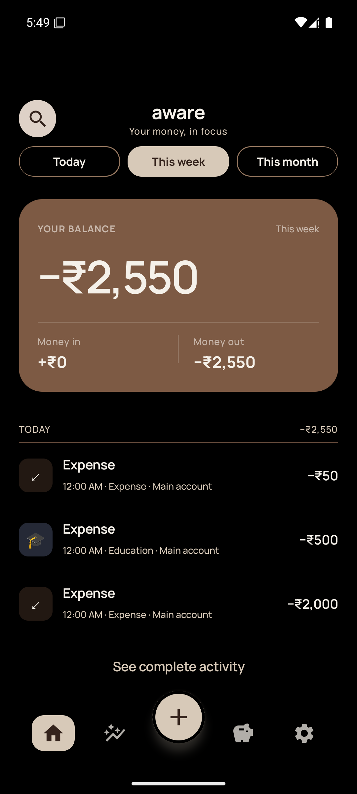
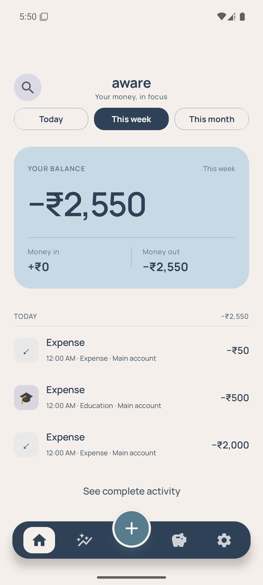
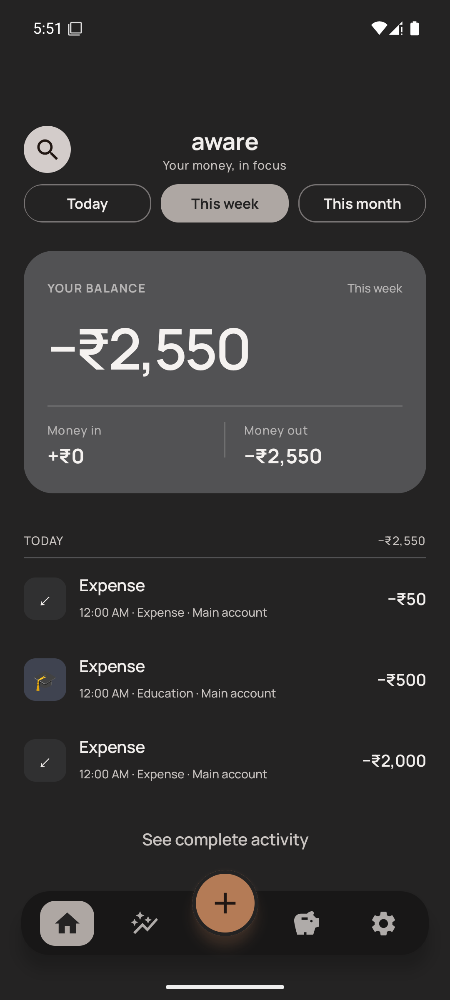
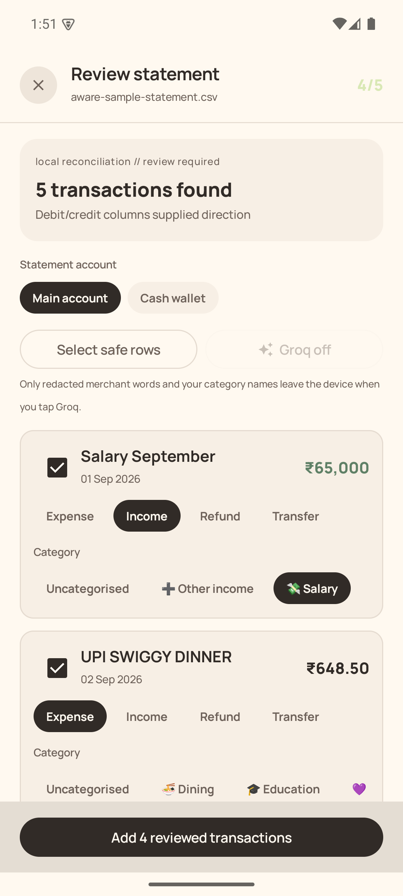
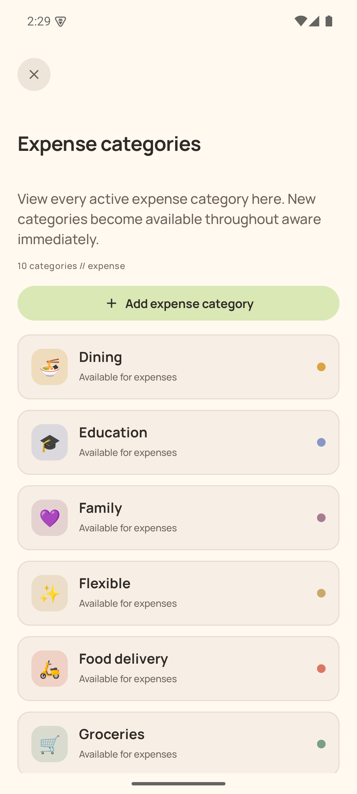
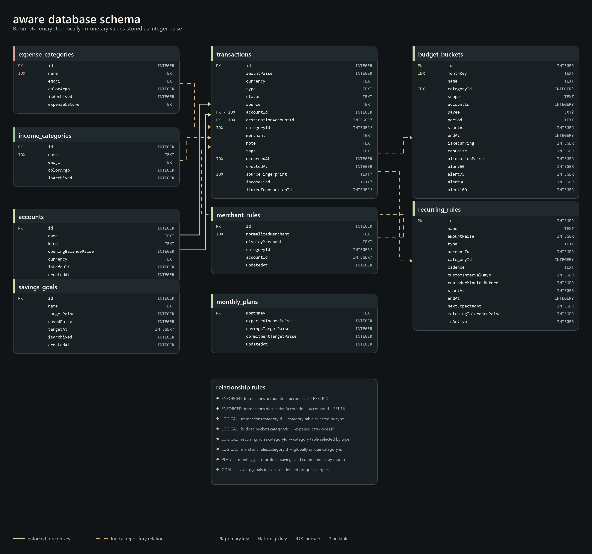

<p align="center">
  
</p>

<p align="center">
  <strong>A private, expressive expense manager for Android.</strong><br/>
  Record money moves, understand the month, and keep every rupee on your device.
</p>

<p align="center">
  
  
  
  
  <a href="https://github.com/FouRSi8/aware/tree/main"></a>
</p>

<p align="center">
  <a href="#download">Download</a> · <a href="#what-aware-does">Features</a> ·
  <a href="#privacy-by-design">Privacy</a> · <a href="#build-it">Build</a> ·
  <a href="CONTRIBUTING.md">Contribute</a>
</p>

---

<p align="center">
  
  &nbsp; 
  &nbsp; 
</p>

<p align="center">
  
  &nbsp; 
  &nbsp; 
</p>

<p align="center"><sub>Linen café · Navy tide · Charcoal &amp; leather</sub></p>

<p align="center">
  
  &nbsp; 
</p>

<p align="center"><sub>Review-first statement import · Dedicated category managers</sub></p>

## Your money, without the surveillance

aware is built around one idea: recording a purchase should be effortless, but
understanding your finances should still feel human. It combines deliberate manual
entry with review-first bank-statement import, keeps cash withdrawals honest, and
separates salary, refunds, transfers, commitments, and discretionary spend.

The result is a ledger that feels alive without sending your financial life to
an analytics company or requiring an account.

## What aware does

| Record | Understand | Plan |
|---|---|---|
| Manual expense, income, transfer, refund, and adjustment entry | Today, week, month, and custom-period views | Overall, category, account, and payee budgets |
| Editable dates for backfilling transactions | Category, payee, and tag breakdowns | Daily, weekly, monthly, yearly, and one-time periods |
| Review-first statement import with duplicate checks | Weekly spending, income, net movement, and top merchant | Expected recurring income and expenses |
| Local debit/credit and balance reconciliation | Largest spending days and month comparison | Merchant rules and category learning |
| Review-first CSV, XLS, and password-protected XLSX statement import | Debit/credit and running-balance reconciliation | Optional, redacted Groq category suggestions |
| Editable expense, income, transfer, and refund entries | Bank-to-cash transfers stay out of spending | Custom accounts, categories, payees, and tags |

### Savings control in v1.6

- **Safe to spend** protects planned savings and fixed commitments before it
  presents a discretionary amount.
- Income is explicitly classified as salary, other earned income,
  reimbursement, pass-through money, or gifts; only genuine earned income is
  included automatically.
- Expense categories distinguish commitments, essentials, discretionary, and
  one-time costs, while linked refunds reduce the appropriate budget usage.
- Monthly plans, editable savings goals, food-delivery frequency/projection,
  unresolved-cash warnings, and an expanded month report turn the ledger into
  concrete next-month decisions.

### Two complete visual identities

- **Cozy** — warm paper, espresso ink, garden pastels, quiet geometry, and
  Manrope typography. Choose Oat garden, Sage & rose, Plum hearth, Linen café,
  Navy tide, or Charcoal & leather; every palette has coordinated light, dark,
  OLED, and launcher-icon treatments.
- **f@#k cozy** — near-black instrumentation, hard frames, neon signals,
  console typography, and deliberately loud composition.

These are not simple color swaps. Both identities share semantic design tokens
while changing typography, shape, surface treatment, and information chrome.

## Privacy by design

- Requests no SMS or payment-notification access.
- Includes no notification-listener service or home-screen widget.
- Encrypts the Room database with SQLCipher and a Keystore-wrapped key.
- Has no account, advertisements, analytics SDK, or cloud synchronization.
- Sends no statements, balances, account numbers, UPI IDs, phone numbers, or references to AI.
- Reads bank statements locally, forgets one-use workbook passwords, and stores only rows the user approves.
- Creates password-encrypted backups; CSV export is explicitly unencrypted.

Read the complete [privacy note](PRIVACY.md).

## Download

> **Latest development version: v1.6.1.** The newest source is always on
> [`main`](https://github.com/FouRSi8/aware/tree/main). This update removes SMS
> reception, payment-notification access, automatic transaction prompts, and the
> home-screen widget. Manual entry and review-first statement import remain.

The newest personal-testing APK will be attached to the repository's
**Releases** page. Android may warn about sideloaded apps;
inspect the source and build it yourself if you prefer.

> Release APKs must be signed with a stable private production key. Debug APKs
> are suitable for development only and should not be treated as production releases.

## Build it

Requirements: Android Studio or JDK 17, Android SDK 36, and Git.

```bash
git clone <repository-url>
cd aware
./gradlew testPlayDebugUnitTest testGithubDebugUnitTest lintPlayDebug assemblePlayDebug assembleGithubDebug
```

On Windows, use `gradlew.bat`. Set `sdk.dir` in an untracked `local.properties`,
or provide `ANDROID_HOME`. Play builds omit `REQUEST_INSTALL_PACKAGES` and the
GitHub updater; GitHub builds retain the explicit release-page update workflow.
The APKs are written beneath `app/build/outputs/apk/play/` and
`app/build/outputs/apk/github/`.

## Architecture

```text
CSV / XLS / XLSX ────────────→ reconciliation ─────────────────────→ review
MANUAL ENTRY ────────────────→ validation ─────────────────────────→ ledger
                                         │
                                         ▼
Compose UI ←── Flow / ViewModel ←── encrypted Room ledger
     │                                   │
     └── budgets · plans · reports · export ─────┘
```

Kotlin · Jetpack Compose · Material 3 · Room · Coroutines/Flow · WorkManager ·
DataStore · Android Keystore · SQLCipher

### Database schema

Income and expense categories live in separate tables with independently unique
names. Room v6 removes the obsolete automatic-capture and widget-report caches
while retaining every ledger record, plan, goal, budget, and recurring rule.

<p align="center">
  
</p>

## Open source

aware is released under GPL-3.0. The current Android interface uses aware's
own Compose components, semantic colour system, and standard Material iconography.
Dependency licences and the repository's historical source notice are recorded in
[THIRD_PARTY_NOTICES.md](THIRD_PARTY_NOTICES.md).

## Contributing

Thoughtful bug reports and focused pull requests are welcome. Start with
[CONTRIBUTING.md](CONTRIBUTING.md), keep financial fixtures synthetic, and do
not attach real transaction messages or account details to an issue.

<p align="center"><sub>made for clarity · kept entirely yours</sub></p>
