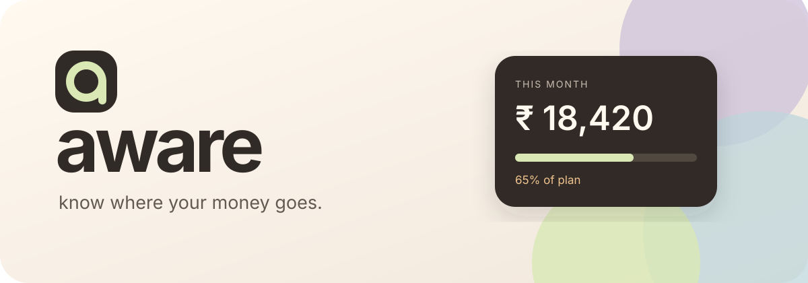
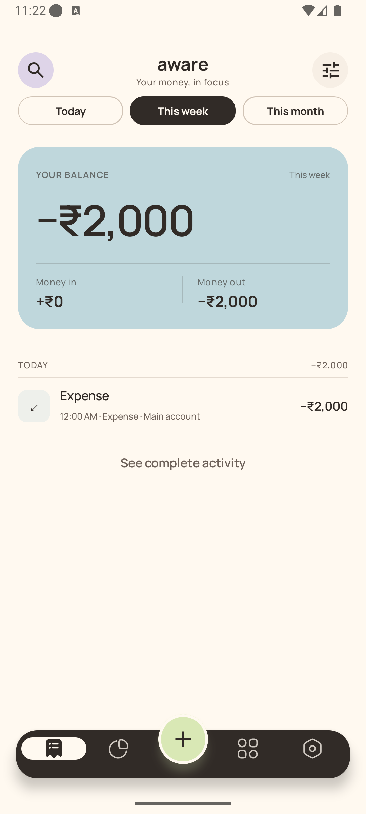
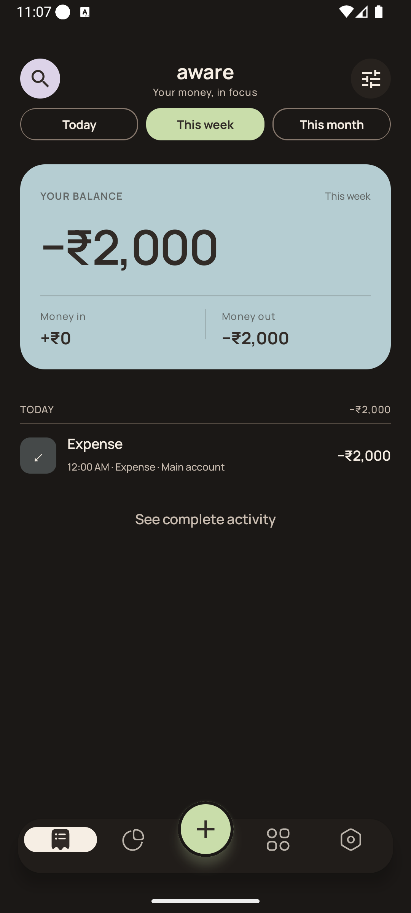
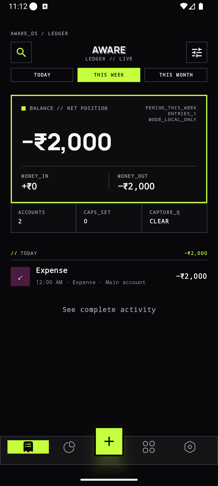

<p align="center">
  
</p>

<p align="center">
  <strong>A private, expressive expense manager for Android.</strong><br/>
  Capture transaction SMS messages, understand the month, and keep every rupee on your device.
</p>

<p align="center">
  
  
  
  
  <a href="https://github.com/FouRSi8/aware/tree/main"></a>
</p>

<p align="center">
  <a href="#download">Download</a> · <a href="#what-aware-does">Features</a> ·
  <a href="#privacy-by-design">Privacy</a> · <a href="#build-it">Build</a> ·
  <a href="CONTRIBUTING.md">Contribute</a>
</p>

---

<p align="center">
  
  &nbsp; 
  &nbsp; 
</p>

## Your money, without the surveillance

aware is built around one idea: recording a purchase should be effortless, but
understanding your finances should still feel human. It turns new bank and UPI
transaction messages into reviewable entries, keeps cash withdrawals honest,
and separates salary, refunds, transfers, commitments, and discretionary spend.

The result is a ledger that feels alive without sending your financial life to
an analytics company or requiring an account.

## What aware does

| Capture | Understand | Plan |
|---|---|---|
| New UPI, bank, card, ATM, salary, refund, and reversal SMS detection | Today, week, month, and custom-period views | Overall, category, account, and payee budgets |
| Review-only Google Pay and super.money notification capture | Category, payee, and tag breakdowns | Daily, weekly, monthly, yearly, and one-time periods |
| Skin-aware home-screen widget with Cozy and f@#k cozy layouts, weekly reports, and payment review | Weekly spending, income, net movement, and top merchant | Expected recurring income and expenses |
| Local deterministic parser with deduplication | Largest spending days and month comparison | Merchant rules and category learning |
| Editable expense, income, transfer, and refund entries | Bank-to-cash transfers stay out of spending | Custom accounts, categories, payees, and tags |

### Two complete visual identities

- **Cozy** — warm paper, espresso ink, garden pastels, quiet geometry, and
  Manrope typography. Choose Oat garden, Sage & rose, Plum hearth, Linen café,
  Navy tide, or Charcoal & leather; every palette has coordinated light, dark,
  OLED, widget, and launcher-icon treatments.
- **f@#k cozy** — near-black instrumentation, hard frames, neon signals,
  console typography, and deliberately loud composition.

These are not simple color swaps. Both identities share semantic design tokens
while changing typography, shape, surface treatment, and information chrome.

## Privacy by design

- Requests `RECEIVE_SMS`, never `READ_SMS`: aware sees only new messages after permission is granted.
- Parses and deduplicates transactions locally.
- Encrypts the Room database with SQLCipher and a Keystore-wrapped key.
- Removes encrypted raw SMS text when resolved or after seven days.
- Has no account, advertisements, analytics SDK, or cloud synchronization.
- Sends no SMS, balances, account numbers, UPI IDs, phone numbers, or references to AI.
- Creates password-encrypted backups; CSV export is explicitly unencrypted.

Read the complete [privacy note](PRIVACY.md).

## Download

> **Latest version available: v1.2.6.** The newest source is always on
> [`main`](https://github.com/FouRSi8/aware/tree/main). This version expands
> Cozy with Linen café, Navy tide, and Charcoal & leather palettes, each with
> light, dark, OLED, widget, and launcher-icon treatments.

The newest personal-testing APK will be attached to the repository's
**Releases** page. Android may warn about sideloaded apps and SMS permission;
inspect the source and build it yourself if you prefer.

> Release APKs must be signed with a stable private production key. Debug APKs
> are suitable for development only and should not be treated as production releases.

## Build it

Requirements: Android Studio or JDK 17, Android SDK 36, and Git.

```bash
git clone <repository-url>
cd aware
./gradlew testDebugUnitTest lintDebug assembleDebug
```

On Windows, use `gradlew.bat`. Set `sdk.dir` in an untracked `local.properties`,
or provide `ANDROID_HOME`. The APK is written to `app/build/outputs/apk/debug/app-debug.apk`.

## Architecture

```text
SMS / PAYMENT NOTIFICATION ──→ local parser ──→ capture candidate ──→ review
                                         │
                                         ▼
Compose UI ←── Flow / ViewModel ←── encrypted Room ledger
     │                                   │
     └── budgets · reports · widget · export ────┘
```

Kotlin · Jetpack Compose · Material 3 · Room · Coroutines/Flow · WorkManager ·
Glance · DataStore · Android Keystore · SQLCipher

## Open source

aware is released under GPL-3.0. The current Android interface uses aware's
own Compose components, semantic colour system, and standard Material iconography.
Dependency licences and the repository's historical source notice are recorded in
[THIRD_PARTY_NOTICES.md](THIRD_PARTY_NOTICES.md).

## Contributing

Thoughtful bug reports and focused pull requests are welcome. Start with
[CONTRIBUTING.md](CONTRIBUTING.md), keep financial fixtures synthetic, and do
not attach real transaction messages or account details to an issue.

<p align="center"><sub>made for clarity · kept entirely yours</sub></p>
